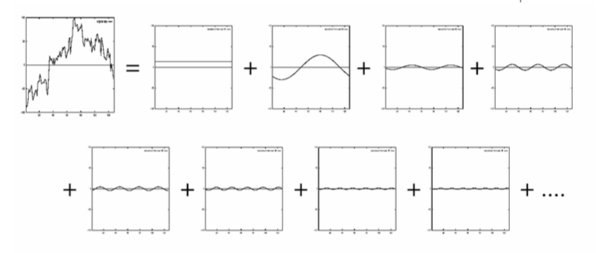
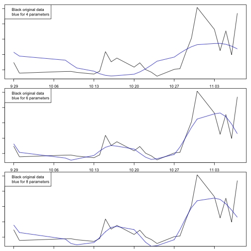
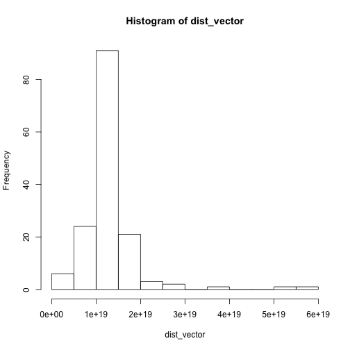
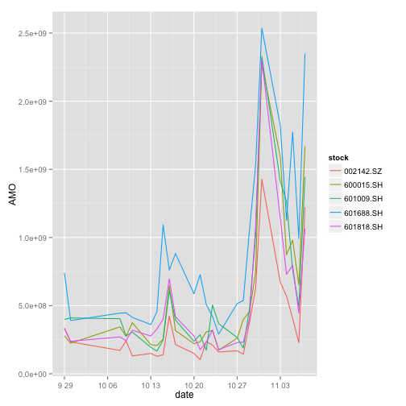
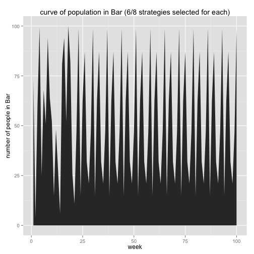
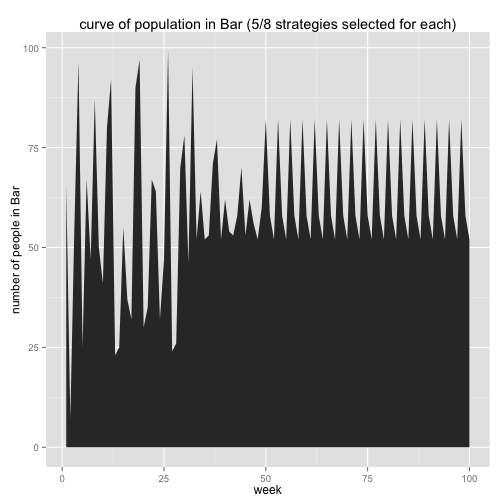
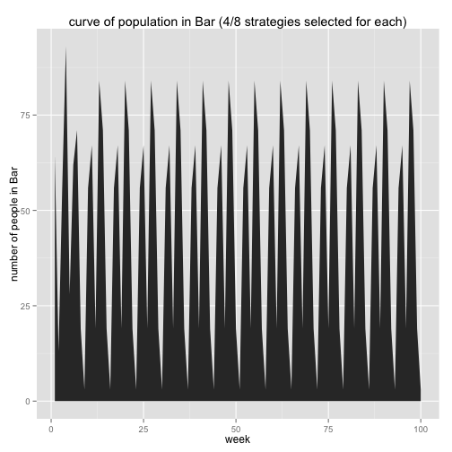

试题一
========================================================

### 分析

对时间序列数据寻找相似pattern，主要有一下两个难点：


* 很难找到直接的配对(match),比如类似文本可以字母直接陪对，所以这里我们需要定义距离函数

* 不好直接确定配对序号（index data),所以这里我们需要一种快速算法。

### 目的

 寻找目标股票成交金额变换*趋势*与模板类似。

### 定义距离函数

距离函数定义有很多种，比如相关系数，马氏距离，$L_p$范数距离
$$D(x,y)=(\sum|x_i-y_i|^p)^{1/p}$$

当$p=2$时候的欧式距离(通常的做法):

$$D(x,y)=(\sum|x_i-y_i|^2)^{1/2}$$

需要寻找相似的序列信号$q$使得
$$D(q,x)=(\sum(q_i-x_i)^2)^{1/2}<=\epsilon$$
其中$\epsilon$为阀值。

#### 选择$L_2$的几点理由

* 满足正交变化

* 容易计算

* 普遍使用


### 如何index时间序列

#### 不直接Index原始数据的理由

* 维度过大

* 需要提出数据的主要特征进行配对分析

这里我们采用离散傅立叶变换的前几个主要特征变量来建立Index。

#### 离散DFT原理:



#### 离散DFT定义:

##### DFT:

$$x_f=(1/n^{1/2})*\sum_{t=0}^{n-1}exp({-j2\pi ft/n})^2,f=0,1,\cdots,n-1$$

#### IDFT(离散傅立叶逆变换):

$$x_t=(1/n^{1/2})\sum_{f=0}^{n-1}X_f exp(j2\pi ft/n)^2, t=0,1,\cdots,n-1$$


#### 能量公式 
$$E(x)=||x||^2=\sum|x_t|^2$$


* 值得注意的是，如果使用快速傅立叶变换FFT，算法复杂性 $O(n \ln n)$


####  Parseval' theorem

* 如果 $X$ 是$x$ 傅立叶变换，则有 $\sum |x_t|^2=\sum|X_f|^2$

由上述理论知道，如果选用全部 n 维 离散傅立叶变换，其结果和直接计算是一致的。
所以这里，我们选择部分振幅值（部分傅立叶变换结果）。

###分析模板数据

我们以模板数据，来分析傅立叶变换情况

```r
source('similarity.R')
```

```
## Loading required package: rJava
## Loading required package: xlsxjars
## Loading required package: reshape2
```

```r
## 数据处理
data<-read.xlsx(file='data(1).xlsx',sheetIndex=1,header=F,startRow=2,
                stringsAsFactors=F)
data1<-data[,c(-1,-2,-3)]
rownames(data1)<-data$X1
dt1<-as.matrix(data1)
## 各只股票成交额 dataframe
dt2<-as.data.frame(t(dt1))

date_data<-read.xlsx(file='data(1).xlsx',sheetIndex=1,header=F,startRow=1,endRow=1,
                     stringsAsFactors=F)
## 时间向量
date_vector<-as.vector(t(date_data[,c(-1,-2)]))
## 模板数据
model_stock<-dt2[,'601688.SH']
print('模板数据的summary')
```

```
## [1] "模板数据的summary"
```

```r
summary(model_stock)
```

```
##      Min.   1st Qu.    Median      Mean   3rd Qu.      Max. 
## 2.911e+08 4.473e+08 7.269e+08 9.105e+08 1.093e+09 2.536e+09
```

```r
print('模板数据选用不同个数傅立叶变换系数的拟合情况')
```

```
## [1] "模板数据选用不同个数傅立叶变换系数的拟合情况"
```

```r
ddt1<-data.frame(date=as.Date(date_vector),model_stock=model_stock,simulation_4=fftExpand(model_stock,4),simulation_6=fftExpand(model_stock,6),simulation_8=fftExpand(model_stock,8))
```


```r
par(mfrow=c(3,1),mar=c(1,1,1,1))
plot(x=ddt1$date,y=ddt1$model_stock,type='l')
lines(x=ddt1$date,y=ddt1$simulation_4,col='blue')
legend('topleft',legend=c('Black original data','blue for 4 parameters'),col=c('black','blue'))

plot(x=ddt1$date,y=ddt1$model_stock,type='l')
lines(x=ddt1$date,y=ddt1$simulation_6,col='blue')
legend('topleft',legend=c('Black original data','blue for 6 parameters'),col=c('black','blue'))
plot(x=ddt1$date,y=ddt1$model_stock,type='l')
lines(x=ddt1$date,y=ddt1$simulation_8,col='blue')
legend('topleft',legend=c('Black original data','blue for 8 parameters'),col=c('black','blue'))
```

 

当选择8个DFT系数的时候，从图中可以看出图像拟合效果已经比较好。
另外我们注意到，DFT变换第一个系数一般和数据数量级（或者说均值相关)。而我们应该主要考虑其成交额随时间的趋势相同。所以这里，我们选取2:7序列的DFT系数作为向量计算距离。

下面计算傅立叶变换系数（显示部分结果)


```r
## 对数据做傅立叶变化
dt3<-apply(dt2,2,fft)
dt4<-apply(dt3,2,abs)
#dt5<-head(dt3,8)
dt5<-dt3[c(2:8),]
dt6<-as.data.frame(dt5)
print(dt6[,1:8])
```

```
##                  000002.SZ              000027.SZ               000100.SZ
## X5  2380074949+  59451039i 1577562377+1037419687i  1639632142-2982806648i
## X6  -974480541-1166203288i  422638281+1246849554i -8792679181- 570689693i
## X7  -144646108-1144010599i  142399883+ 977491799i -4004204374+1901339898i
## X8  -429636768+ 156872129i -223952229+ 970545365i  2403780077+2548420179i
## X9   546765085+ 585483255i -553039841+ 600422486i  1711539285+ 910840010i
## X10 -183336942+1101156872i -309172880+ 172176710i  1286193038-1091487230i
## X11 -611096897+ 386046975i -162391601+ 224752143i -1153900142+ 592643259i
##                   000157.SZ              000333.SZ             000338.SZ
## X5   2721529502+2034795012i 1525737884+1100024621i 1745960457+631898908i
## X6  -1866882510+3217598223i  253896853+ 616128550i -792358203+646220449i
## X7  -2254750528+ 426349586i 1386502908- 530621587i -921293692-119211667i
## X8  -1352645643-1260571798i 1449274103- 164429926i -444176008-403743608i
## X9   -103707120-1298325748i  689264790+1542759299i  -27571801-101213238i
## X10  1342276933- 674292187i  384123508+ 478664865i  696674949- 28552091i
## X11   658550632+ 950642467i  170405522+  70577394i  297399936+ 89675999i
##                 000402.SZ              000423.SZ
## X5   907522331+430715641i  -96728396-1692338980i
## X6  -582744929+609506391i  215110664- 328072899i
## X7   -32164570+312847723i -159069157- 943124199i
## X8   -17496566-186629257i -299136137- 227559657i
## X9  -407880973+160985404i -792614816- 296159525i
## X10 -434997002+337217673i -347691443+ 718889048i
## X11 -280408055-  2456321i   80337654-  83495748i
```

计算各只股票与模板的距离，显示部分结果，及其summary和 hist图。

```r
## 计算与模板的距离
model_vector<-dt5[,'601688.SH']
dist_vector<-apply(dt5,2,complexDist,model_vector)
head(dist_vector)
```

```
##    000002.SZ    000027.SZ    000100.SZ    000157.SZ    000333.SZ 
## 1.322974e+19 1.032565e+19 2.915943e+19 1.159726e+19 9.306556e+18 
##    000338.SZ 
## 1.181271e+19
```

```r
summary(dist_vector)
```

```
##      Min.   1st Qu.    Median      Mean   3rd Qu.      Max. 
## 0.000e+00 1.042e+19 1.300e+19 1.313e+19 1.432e+19 5.870e+19
```

```r
par(mfrow=c(1,1))
hist(dist_vector)
```

 

###  阀值$\epsilon$ 确定

从图中可以看出其距离值集合近似满足正态分布.我们假设其分布满足正态分布，这里我们寻找均值较小，如果假设检验中，零假设为$dist=mean(\hat{dist}$,则其备则假设为$dist<mean(\hat{dist})$,即若与模板距离近的话，应该拒绝该假设。通常假设检验选取$\alpha=0.1$, 于是阀值$\epsilon$应该就在其十分位处，于是我们有

```r
epsilon=qnorm(0.1,mean=mean(dist_vector),sd=sd(dist_vector))
print(epsilon)
```

```
## [1] 4.647612e+18
```
#### 筛选所有符合条件的股票


```r
index<-dist_vector<epsilon
name_index<-names(dist_vector[index])
print(name_index)
```

```
## [1] "002142.SZ" "600015.SH" "601009.SH" "601688.SH" "601818.SH"
```

### 做图检验所选股票情况

```r
require(reshape2)
d_final<-dt2[,name_index]
d_final$date<-as.Date(date_vector)
d_data<-melt(d_final,id.vars=c('date'),value.name='AMO',variable.name='stock')
ggplot(d_data,aes(x=date,y=AMO,col=stock,main='所筛选股票成交情况'))+geom_line()
```

 

### 可能性和拓展

1. 采用不同的从时序到频数的变换替换DFT 

..* 采用 Discrete Wavelet Transform(DWT)变换. [DWT](figure/harr.png)

2. 采用不同建立Index的方法

..* 选取DFT系数倒数几个

..* 采用R-tree 建立 index (又称 “F-index”)


3. 考虑时间序列的subsequence

## 参考文献

* R. Agrawal, C. Faloutsos, and A. Swami, Efficient Similarity Search in Sequence Databases.

* K.-P. Chan and A.W.-C. Fu, Efficient Time Series Matching by Wavelets.

* C Faloutsos, M Ranganathan, Y Manolopoulos, Fast subsequence matching in time-series databases

* [傅里叶变换算法](http://blog.csdn.net/v_JULY_v/article/details/6196862)

* [数据处理](http://course.bnu.edu.cn/course/jswl/files/class/skja/ppt04.pdf)

* [Matlab help](http://cn.mathworks.com/help/matlab/math/discrete-fourier-transform-dft.html)


问题2
=================================

### 建立策略集合

```r
## 每个函数代表一种策略
## input： vector 是历史在Bar人数数据
## output: {1,0} 决定去或不去

predict1<-function(vector){
  ##预测方案1:与上一星期一致；初始值0:100，随机设置；
  ##input: 历史酒吧人数向量
  ##output: 1:去酒吧；0呆家
  if(length(vector)<1){
    set.seed(123)
    n_last<-sample(x=c(0:100),1)
    return(ifelse(n_last>60,0,1))
  }else{
    n_last<-tail(vector,1)
    return(ifelse(n_last>60,0,1))
  }
}

predict2<-function(vector){
  ##预测方案2: 与上一星期对称；初始值0:100，随机选取；
  ## input: 历史酒吧热书向量
  ## output: 1:去酒吧；0:呆家
  if(length(vector)<1){
    set.seed(124)
    n_last<-sample(x=c(0:100),1)
    n_pred<-50+51-n_last
    return(ifelse(n_pred>60,0,1))
  }else{
    n_last<-tail(vector,1)
    n_pred<-50+51-n_last
    return(ifelse(n_pred>60,0,1))
  }
}

predict3<-function(vector){
  ##预测方案3:过去4星期的平均值；初始值1:100，随机选取；
  ## 如果历史数据个数少于4，直接求其平均值
  if(length(vector)<1){
    set.seed(129)
    n_last<-sample(x=c(0:100),1)
    return(ifelse(n_last>60,0,1))
  }
  if(length(vector)<=4){
    n_pred<-mean(vector)
    return(ifelse(n_pred>60,0,1))
  }else{
    n_pred<-mean(tail(vector,4))
    return(ifelse(n_pred>60,0,1))
  }
}


predict4<-function(vector){
  ##预测方案4：过去八周的线型趋势
  ##不到8周，则以全部历史数据作为趋势
  ## 初始随机0:100 设定
  ## 如果只有一组历史数据，直接以这组数据作为预测值
  #处理初始值
  if(length(vector)<1){
    set.seed(1122)
    n_last<-sample(c(0:100),size=1)
    n_pred<-n_last
    return(ifelse(n_pred>60,0,1))
  }
  if(length(vector)<2){
    n_pred<-tail(vector,1)
    return(ifelse(n_pred>60,0,1))
  }
  #处理问题：周数小于8
  if(length(vector)<8){
    model<-lm(vector~c(1:length(vector)))
    n_pred<-model$coefficients[1]+(length(vector)+1)*model$coefficients[2]
    return(ifelse(n_pred>60,0,1))
  }else{
    ## 线性拟合
    model<-lm(tail(vector,8)~c(1:8))
    n_pred<-model$coefficients[1]+(length(vector)+1)*model$coefficients[2]
    return(ifelse(n_pred,0,1))
  }
}

## 预测方案5:向前两周一致
## 少于两周，按一周处理
predict5<-function(vector){
  if(length(vector)>=2){
    n_pred<-vector[length(vector)-1]
    return(ifelse(n_pred>60,0,1))
  }else{
    if(length(vector)<1){
      set.seed(122)
      n_last<-sample(c(0:100),1)
      n_pred<-n_last
      return(ifelse(n_pred>60,0,1))
    }else{
      n_pred<-vector
      return(ifelse(n_pred>60,0,1))
    }
  }
}

## 预测方案6:向前5周一致
## 少于两周，与第一周一致
predict6<-function(vector){
  if(length(vector)>=5){
    n_pred<-vector[length(vector)-4]
    return(ifelse(n_pred>60,0,1))
  }else{
    if(length(vector)<1){
      set.seed(113)
      n_last<-sample(c(1:100),1)
      n_pred<-n_last
      return(ifelse(n_pred>60,0,1))
    }else{
      n_pred<-vector[1]
      return(ifelse(n_pred>60,0,1))
    }
  }
}

## 预测方案7: 与前一周相反
## 即若前一周超过60，本周预测小于60，反之亦然

predict7<-function(vector){
  if(length(vector)>0){
    return(ifelse(tail(vector,1)>60,1,0))
  }else{
    return(1)
  }
}

## 预测方案8 : 一般情况，预测与前一周一致，如果连续两周是相同的结果（都大于60或小于等于
## 60),预测关于60相反。
predict8<-function(vector){
  if(tail(vector,1)>60){
    return(ifelse(vector[length(vector)-1]),1,0)
  }else{
    return(ifelse(vetor[length(vector)-1]<60),0,1)
  }

  
}
```


### 构建和初始化一个 ’在Bar‘ 情况的对象：

对象包含以下变量：

* 在Bar人数的历史记录:num_history
* 所有策略集合：stg
* 每个人所拥有的策略组合：per_list[]
* 每个策略当前回测胜利数：stg_win
* 当前周数:N_week
* 每个策略当前预测结果：pred_now


```r
source('predict.R')
initGroup<-function(n=100,stg,m,m_select){
  ##初始化一个关于100人El Farol Bar状态的 class
  initgroup<-list()
  class(initgroup)<-'BarGroup'
  ## 初始历史每周在Bar人数
  initgroup$num_history<-c(44,78,56,15,23,67,84,34,45,76,40,56,22,35)

  ## 初始化每个人所用有的策略组合
  initgroup$per_list<-list()
  for(i in c(1:n)){
    #set.seed(10*i)  ## 为了可以实验结果的可重复性
    initgroup$per_list[[i]]<-sample(c(1:m),m_select,replace=T)
  }
  ## 初始每个策略当前回测胜利个数
  initgroup$stg_win<-rep(0,m)
  
  print(initgroup$num_history)
  ## 记录当前周数
  initgroup$n_week<-0
  ## 策略集合
  initgroup$stg<-stg
  ## 各个策略当前预测结果
  initgroup$pred_now<-sapply(initgroup$stg, do.call,list(initgroup$num_history))
  return(initgroup)
}
```


### 每周更新对象


```r
updateGroup<-function(initgroup){
  ## 更新周数
initgroup$n_week<-initgroup$n_week+1
 ## 当前所有策略预测情况
pred_now<-sapply(initgroup$stg, do.call,list(initgroup$num_history))
## 更新各个策略的回测情况
if(length(initgroup$num_history)<1){
  status_last<-0
}else{
  status_last<-ifelse(tail(initgroup$num_history,1)>60,0,1)
}
##各个策略判断情况
status_judge<-1-abs(status_last-initgroup$pred_now)
## 更新各个策略的回测胜利数
#print(status_judge)
initgroup$stg_win<-status_judge+initgroup$stg_win
#print(initgroup$stg_win)
 ## 计算当前每个人的策略选择（回测）和是否上Bar
sum_bar<-0
  for(i in seq(initgroup$per_list)){
    ## 当前所选策略回测胜利数
    selected_stg_win<-(initgroup$stg_win)[(initgroup$per_list)[[i]]]
    ## 最好策略index
    index<-which.max(selected_stg_win)
    ##index_stg<-initgroup$per_list[[i]][index]
    ## 计算去Bar人数
    sum_bar<-sum_bar+pred_now[initgroup$per_list[[i]][index]]
  } 
##更新历史去Bar 人数
initgroup$num_history<-c(initgroup$num_history,sum_bar)
## 更新当前各个策略的预测情况
initgroup$pred_now<-pred_now
return(initgroup)
}
test<-function(temp){  
  print(temp$num_history)
}
```


### 模拟每周去Bar情况

* 默认人数 n=100
* 默认持续周数 maxism_week=100
* 策略总数 
* 策略集合 stg


```r
## 模拟每天去Bar情况
simulatingBar<-function(stg,m_select=3,maxism_week=100,n=100,m=6){
  init_g<-initGroup(n=100,stg,m,m_select)
  while(init_g$n_week<=maxism_week){
    init_g<-updateGroup(init_g)
  }
  print(init_g$num_history)
  return(init_g)
}
```

### 主程序，赋值计算

```r
source('barClass.R')
source('predict.R')
stg<-c(predict1,predict2,predict3,predict4,predict5,predict6,predict7,predict8)
n=100
m_select=6
m=8
```

### 画图，查看结果,在Bar人数曲线图

```r
require(ggplot2)
temp<-simulatingBar(stg=stg,m_select=m_select,maxism_week=100)
```

```
## Warning in status_judge + initgroup$stg_win:
## 长的对象长度不是短的对象长度的整倍数
```

```r
qplot(x=c(1:100),y=tail(temp$num_history,100),geom='area',xlab='week',ylab='number of people in Bar',main=paste('curve of population in Bar','(6/8 strategies selected for each)'))
```

 


```r
require(ggplot2)
m_select=5
temp<-simulatingBar(stg=stg,m_select=m_select,maxism_week=100)
```

```
## Warning in status_judge + initgroup$stg_win:
## 长的对象长度不是短的对象长度的整倍数
```

```r
qplot(x=c(1:100),y=tail(temp$num_history,100),geom='area',xlab='week',ylab='number of people in Bar',main=paste('curve of population in Bar','(5/8 strategies selected for each)'))
```

 


```r
require(ggplot2)
m_select=4
temp<-simulatingBar(stg=stg,m_select=m_select,maxism_week=100)
```

```
## Warning in status_judge + initgroup$stg_win:
## 长的对象长度不是短的对象长度的整倍数
```

```r
qplot(x=c(1:100),y=tail(temp$num_history,100),geom='area',xlab='week',ylab='number of people in Bar',main=paste('curve of population in Bar','(4/8 strategies selected for each)'))
```

 


